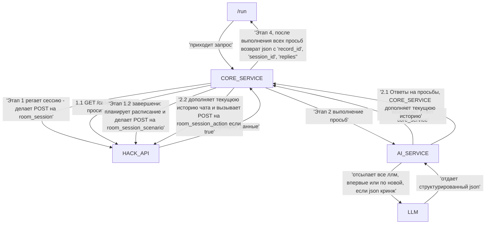

```mermaid
graph TD
    A["/run"] --> |'приходит запрос'| CORE_SERVICE
    CORE_SERVICE --> |'Этап 1 регает сессию - делает POST на room_session'| HACK_API
    CORE_SERVICE --> |"1.1 GET /case/2/getData просит данные"| HACK_API
    HACK_API --> |'возращает данные'| CORE_SERVICE

    AI_SERVICE --> |'отсылает все ллм, впервые или по новой, если json кринж'| LLM
    LLM --> |'отдает структурированный json'| AI_SERVICE

    AI_SERVICE --> |'возращает ответ core_service'| CORE_SERVICE

    CORE_SERVICE --> |'Этап 1.2 завершени: планирует расписание и делает POST на room_session_scenario'| HACK_API

    CORE_SERVICE --> |'Этап 2 выполнение просьб'| AI_SERVICE
    AI_SERVICE --> |'2.1 Ответы на просьбы, CORE_SERVICE дополняет текущюю историю'| CORE_SERVICE
    CORE_SERVICE --> |'2.2 дополняет текущюю историю чата и вызывает POST на room_session_action если true'| HACK_API
    
    CORE_SERVICE --> |'Этап 4, после выполнения всех просьб возврат json с 'record_id', 'session_id', 'replies''| A
```